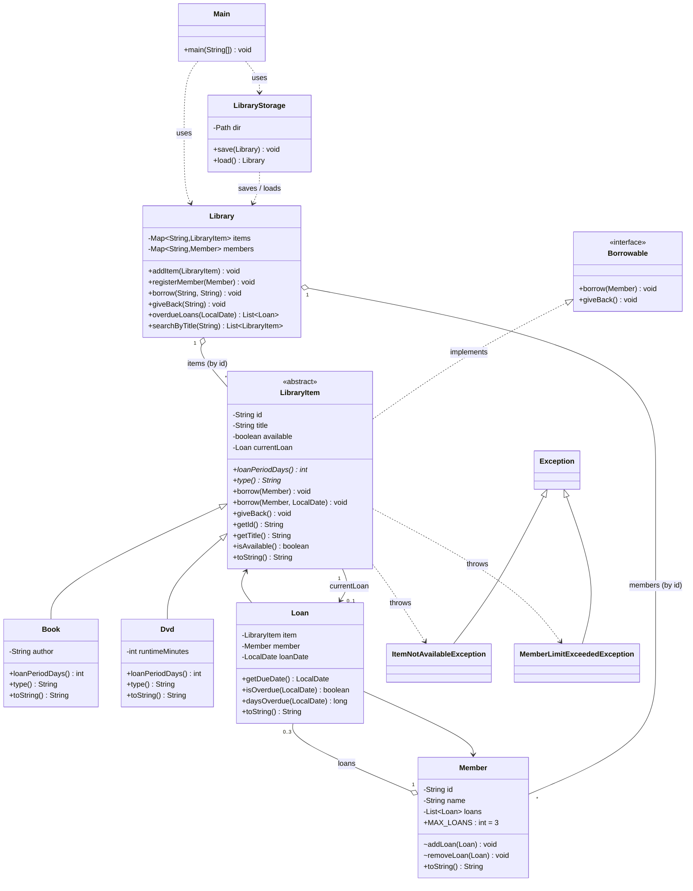

# Class Diagram – Library Management System

Paste the block below into https://mermaid.live (or any Mermaid viewer) to render and export it as an image for submission.

```mermaid
classDiagram
    direction TB

    class Borrowable {
        <<interface>>
        +borrow(Member) void
        +giveBack() void
    }

    class LibraryItem {
        <<abstract>>
        -String id
        -String title
        -boolean available
        -Loan currentLoan
        +loanPeriodDays()* int
        +type()* String
        +borrow(Member) void
        +borrow(Member, LocalDate) void
        +giveBack() void
        +getId() String
        +getTitle() String
        +isAvailable() boolean
        +toString() String
    }

    class Book {
        -String author
        +loanPeriodDays() int
        +type() String
        +toString() String
    }

    class Dvd {
        -int runtimeMinutes
        +loanPeriodDays() int
        +type() String
        +toString() String
    }

    class Member {
        -String id
        -String name
        -List~Loan~ loans
        +MAX_LOANS : int = 3
        ~addLoan(Loan) void
        ~removeLoan(Loan) void
        +toString() String
    }

    class Loan {
        -LibraryItem item
        -Member member
        -LocalDate loanDate
        +getDueDate() LocalDate
        +isOverdue(LocalDate) boolean
        +daysOverdue(LocalDate) long
        +toString() String
    }

    class Library {
        -Map~String,LibraryItem~ items
        -Map~String,Member~ members
        +addItem(LibraryItem) void
        +registerMember(Member) void
        +borrow(String, String) void
        +giveBack(String) void
        +overdueLoans(LocalDate) List~Loan~
        +searchByTitle(String) List~LibraryItem~
    }

    class LibraryStorage {
        -Path dir
        +save(Library) void
        +load() Library
    }

    class Main {
        +main(String[]) void
    }

    class ItemNotAvailableException
    class MemberLimitExceededException
    class Exception

    Borrowable <|.. LibraryItem : implements
    LibraryItem <|-- Book
    LibraryItem <|-- Dvd
    Exception <|-- ItemNotAvailableException
    Exception <|-- MemberLimitExceededException

    Library "1" o-- "*" LibraryItem : items (by id)
    Library "1" o-- "*" Member : members (by id)
    Member "1" o-- "0..3" Loan : loans
    LibraryItem "1" --> "0..1" Loan : currentLoan
    Loan --> LibraryItem
    Loan --> Member

    LibraryStorage ..> Library : saves / loads
    Main ..> Library : uses
    Main ..> LibraryStorage : uses
    LibraryItem ..> ItemNotAvailableException : throws
    LibraryItem ..> MemberLimitExceededException : throws
```
